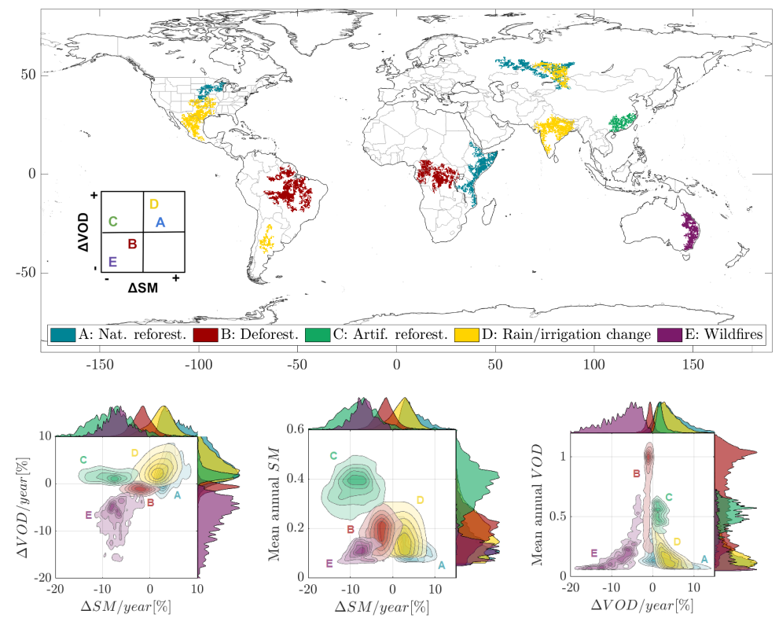

# Soil and vegetation water content identify main terrestrial ecosystem changes

# Abstract

Environmental change is a consequence of many interrelated factors. How vegetation responds to natural and human activity is yet not well established, quantified, and understood. Recent satellite missions providing hydrologic and ecological indicators enable better monitoring of Earth system changes, yet there is no automatic way to address this issue directly from observations. Here, we develop an observation-based methodology to capture evidence of changes in global terrestrial ecosystems and attribute these changes to natural or anthropogenic activity. We use \blue{the longest time record of} global microwave L-band soil moisture (SM) and vegetation optical depth (VOD) as satellite data and build spatially-explicit maps of change in soil and vegetation water content and biomass reflecting large ecosystem changes during the last decade, 2010-2020. Regions of prominent trends (from -8% to 9% per year) are observed, especially in humid and semi-arid climates. We further combine such trends with land cover change maps, vegetation greenness, and precipitation variability to assess their relationship with major documented ecosystem changes. Several regions emerge from our results. They cluster changes according to human activity drivers, including deforestation (Amazon, Central Africa) and wildfires (East Australia), artificial reforestation (South-East China), abandonment of farm fields (Central Russia), and climate shifts related to changes in precipitation variability (East Africa, North America, and Central Argentina). Using the high sensitivity of soil and vegetation water content to ecosystem changes, microwave satellite observations enable us to quantify and attribute global vegetation responses to climate or anthropogenic activities, as a direct measure of environmental changes and the mechanisms driving them.

# Results


Top: The five identified clusters of SM and VOD trends globally, with their semantic attribution. Bottom: identified clusters represented in bivariate spaces between (left) trends of SM and VOD, (middle) trends in SM and mean annual SM, and (right) trends of VOD and mean annual VOD. Each cluster emerges as an independent group from the joint SM and VOD trend space (bottom-left): clusters A and D show a positive change in both SM and VOD, clusters B and E show negative SM and VOD changes -more pronounced in E-, cluster C shows a negative SM change and a positive VOD change. Estimated joint and marginal distributions for SM and VOD highlight the distinct monotonic trends of soil and vegetation water content in each cluster. The relation between the relative trend in VOD to its annual mean (right) shows how regions with low VOD levels on average are more sensitive to VOD changes. Using the SM trends alone (middle) allow us identifying all clusters but C, which is an exception due to artificial reforestation and the induced need for groundwater. Clusters A and D only become separable using the trends in VOD and rainfall, which are more pronounced in D. 

# Data and code availability

All the analysis was performed in MATLAB. {Data and code snippets are provided for reproducibility here: \href{https://github.com/IPL-UV/}

# How to cite our work

If you find this useful, consider citing our work:

><b>Soil and vegetation water content identify main terrestrial ecosystem changes</b>
Diego Bueso, Maria Piles, Philippe Ciais, Jean-Pierre Wigneron, Álvaro Moreno-Martínez and Gustau Camps-Valls
Natl Sci Rev, 2023

```
@article {Camps-Vallseabc7447,
  author = {Bueso, D. and Piles, M. and Ciais, P. and Wigneron, JP. and Moreno-Martinez, A. and Camps-Valls, G.},
  title = {Soil and vegetation water content identify main terrestrial ecosystem changes},
  volume = {},
  number = {},
  year = {2023},
  doi = {},
  publisher = {},
  URL = {},
  journal = {}
}
```
# Acknowledgements
MP was supported by the project LEAVES under grant RTI2018-096765-A-100 funded by MCIN/AEI/10.13039/501100011033 and by the European Regional Development Fund (ERDF, EU). GCV was supported by the European Research Council (ERC) Synergy Grant “Understanding and Modelling the Earth System with Machine Learning (USMILE)” under the Horizon 2020 research and innovation programme (Grant agreement No. 855187). The authors thank Miguel Mahecha from University of Leipzig for helpful comments. 
